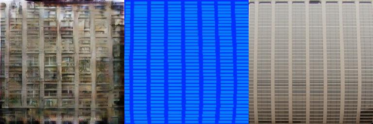
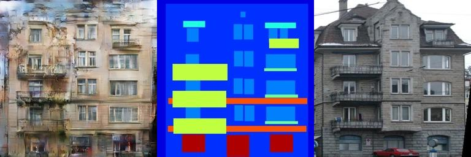
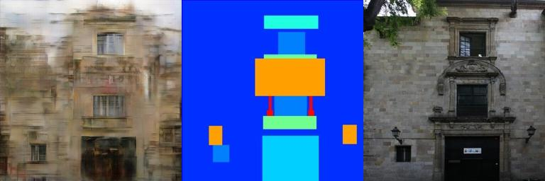
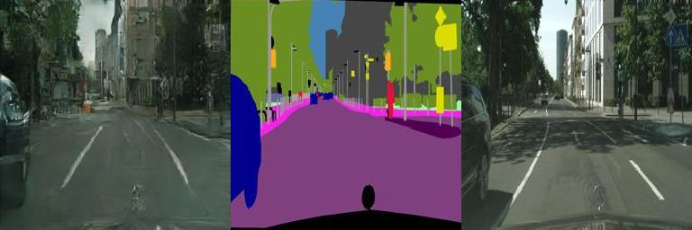
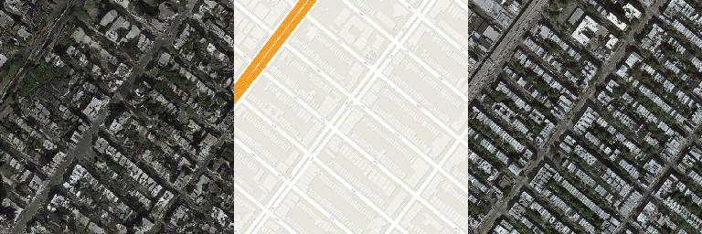

Pix2Pix
======================

dataset 
---------
1. facades
2. citiscape
3. maps
4. edges2shoes
5. edges2handbags

* dataset link: https://people.eecs.berkeley.edu/~tinghuiz/projects/pix2pix/datasets/

#### facades dataset

<table align='center'>
<tr align='center'>
 <td> pytorch implementaion(epoch = 200)</td>
 </tr>
<tr>
<tr align='center'>
 <td> generated image | input image | ground truth</td>
 </tr>
<tr>
 <td></td>
</tr>
<tr>
 <td></td>
</tr>
<tr>
 <td></td>
</tr>
<tr>
 <td></td>
</tr>
<tr>
 <td></td>
</tr>
<tr>
 <td></td>
</tr>
</table>

<table align='center'>
<tr align='center'>
 <td> tensorflow implementaion(epoch = 200)</td>
 </tr>
<tr>
 <td></td>
</tr>
<tr>
 <td></td>
</tr>
<tr>
 <td></td>
</tr>
</table>

#### citiscape dataset

<table align='center'>
<tr align='center'>
 <td> pytorch implementaion(epoch = 200)</td>
 </tr>
<tr>
 <td></td>
</tr>
<tr>
 <td></td>
</tr>
<tr>
 <td></td>
</tr>
</table>

#### maps dataset

<table align='center'>
<tr align='center'>
 <td> pytorch implementaion(epoch = 200)</td>
 </tr>
<tr>
 <td></td>
</tr>
<tr>
 <td></td>
</tr>
<tr>
 <td></td>
</tr>
</table>

#### edges2shoes dataset

<table align='center'>
<tr align='center'>
 <td> pytorch implementaion(epoch = 200)</td>
 </tr>
<tr>
 <td></td>
</tr>
<tr>
 <td></td>
</tr>
<tr>
 <td></td>
</tr>
</table>

#### edges2handbags dataset

<table align='center'>
<tr align='center'>
 <td> pytorch implementaion(epoch = 200)</td>
 </tr>
<tr>
 <td></td>
</tr>
<tr>
 <td></td>
</tr>
<tr>
 <td></td>
</tr>
</table>

## Reference

1. Isola, Phillip, et al. "Image-to-image translation with conditional adversarial networks."
(Full paper: https://arxiv.org/pdf/1611.07004.pdf)
2. https://github.com/phillipi/pix2pix
3. https://github.com/znxlwm/pytorch-pix2pix

